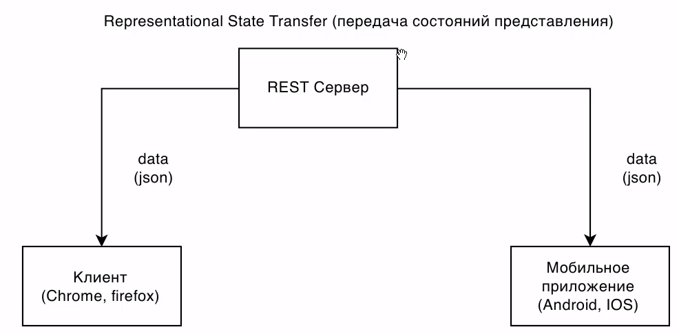
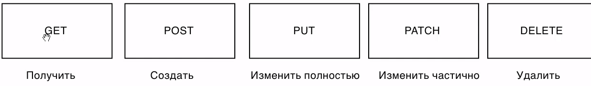
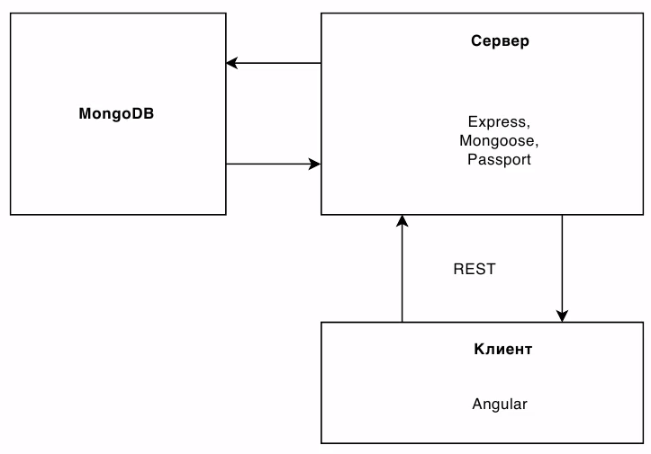
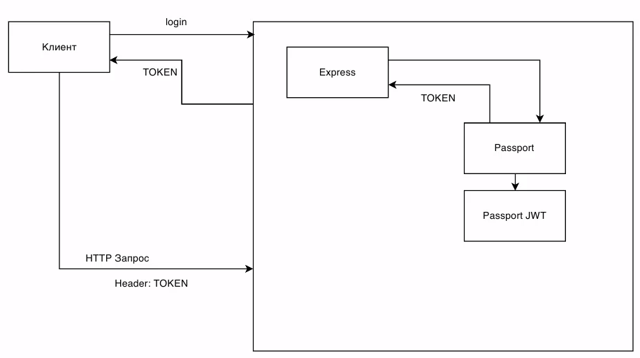
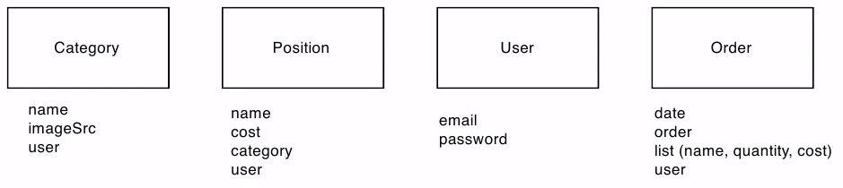
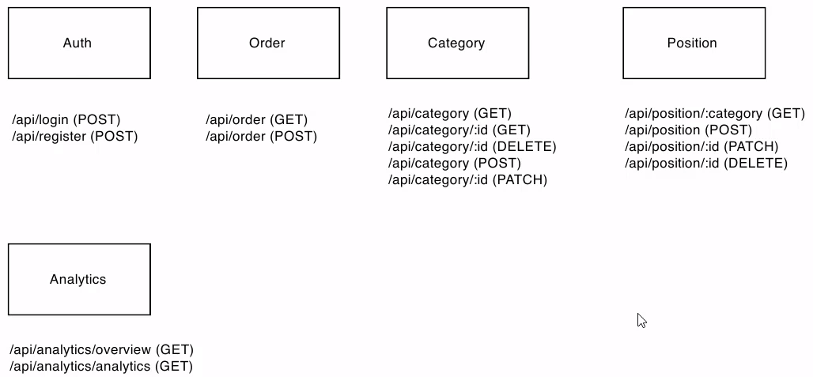

https://www.youtube.com/watch?v=Rwi2aaCr9uo&list=PLo_TKgaR3o1HDJGZbxAGXbBF8dCBmTWnm&index=1

# 01. Обзор архитектуры

## 1. REST API

## 2. Основные типы запросов к серверу  

## 3. Архитектура приложения

## 4. Авторизация

## 5. Модели

## 6. API роуты

