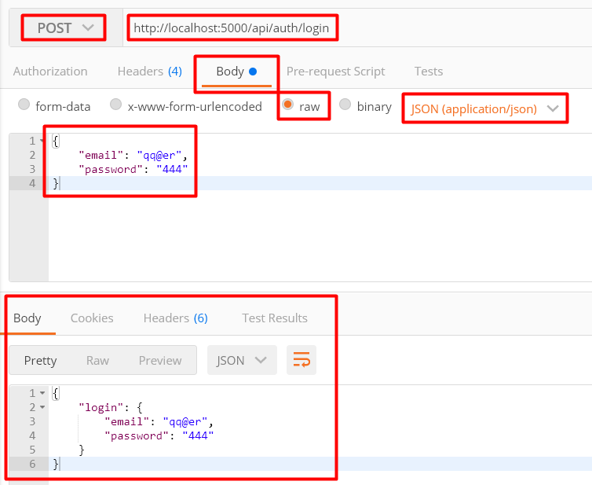

## 04. body-parser

### 1. HTTP-метод POST

**HTTP-метод POST** - предназначен для отправки данных на сервер.      

Данные POST запроса передаются в body, поэтому необходимо установить специальную библиотеку для express - **body-parser**, которая будет парсить тело запроса и записывать в req.body то, что было передано в запроссе.     

### 2. Установка и подключение body-parser

Устанавливаем *body-parser*:    
`npm i body-parser`

Подключаем 'body-parser' в *app.js*:
```js
// const express = require('express')

// Импортируем body-parser
const bodyParser = require('body-parser')

// ...

// const app = express()

// Парсим json
app.use(bodyParser.json())

// Парсим данные формы
app.use(bodyParser.urlencoded({extended: true}))

// ...
```

### 3. Добавляем обработчик для POST запроса

В файле *controllers\auth.js* добавляем обработчик для запросса http://localhost:5000/api/auth/login:
```js
// module.exports.login = (req, res) => {
	res.status(200).json({
		login: {
			email: req.body.email,
			password: req.body.password
		}
	})
// }
```

Переходим в Postman и тестируем запрос:  
