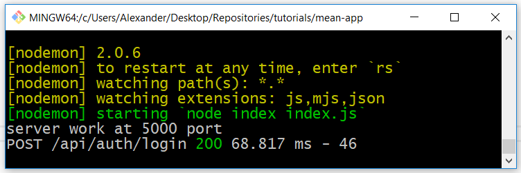

## 05. Cors и Morgan

**Cors** - библиотека, с помощью которой сервер может обрабатывать CORS запросы (если клиент находится на другом домене, то сервер сможет отвечать ему).

**Morgan** - библиотека, с помощью которой можно логировать запросы.

Устанавливаем библиотеки *cors* и *morgan*:   
`npm i cors morgan`

Подключаем библиотеки *cors* и *morgan* в *app.js*:
```js
// const express = require('express')
// const bodyParser = require('body-parser')

const cors = require('cors')
const morgan = require('morgan')

// ...

// const app = express()

// Говорим morgan'у, что мы в режиме разработки
app.use(morgan('dev'))

// app.use(bodyParser.json())
// app.use(bodyParser.urlencoded({extended: true}))

app.use(cors())

// ...
```

Теперь, если отправим запрос http://localhost:5000/api/auth/login, то в консоли увидим лог:

 