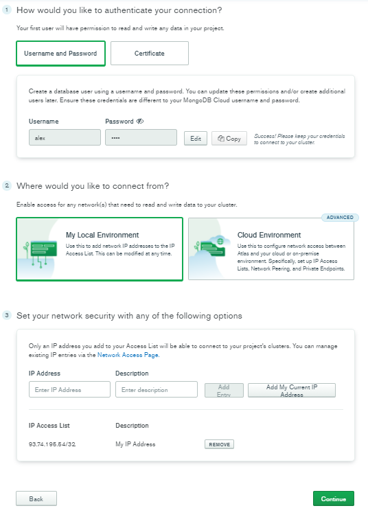

# 06. Подключение mongoDB

## 1. Установка Mongoose:

**Mongoose** - ODM-библиотека (Object Document Mapper - объектно-документный отобразитель), предоставляет возможность применения строгих типов данных для создания и хранения документов в MongoDB.

`npm i mongoose`

## 2. Подключение MongoDB к приложению с помощью Mongoose:

**MongoDB** - NoSQL база данных, хранит данные в формате json-объектов.

*index.js*:
```js
// const app = require('./app')
// const port = process.env.PORT || 5000

const mongoose = require('mongoose')

async function start() {
	try {
		await mongoose.connect('', {
			useNewUrlParser: true,
			useFindAndModify: false,
			useUnifiedTopology: true 
		})
		app.listen(port, () => console.log(`server work at ${port} port`))
	} catch (e) {
		console.log(e)
	}
}

start()

// Следующую строку переносим внутрь ф-ции start()
// app.listen(port, () => console.log(`server work at ${port} port`))
```

## 3. Создание облачной базы данных MongoDB:

**1. Регистрируемся на сайте https://www.mongodb.com/**

**2. Заполняем форму -> нажимаем 'Continue'**


**3. *Select a Cluster* - выбираем cloud provider, бесплатную конфигурацию -> 'Build MO Cluster'**


Время создания кластера займет 3-5 минут.

**4. *Enable Data Access* - создаем database user, добавляем IP, который может стучаться к базе -> нажимаем 'Continue'**



**5. *Pick Connection* -> нажимаем 'Continue'**


**6. *Connect to Cluster* -> нажимаем 'Continue'**

**7. Получаем ключ, с помощью которого база будет подключенна к приложению**


**8. Вставляем ключ в index.js**

В пункте 7 был получен ключ такого вида `mongodb+srv://alex:<password>@cluster0.5qcws.mongodb.net/<dbname>?retryWrites=true&w=majority`, в котором:
- вместо <password> - вставляем пароль, который был задан в пункте 4
- <dbname> - придумываем имя для нашей базы
- строку '?retryWrites=true&w=majority' можно удалить

```js
async function start() {
	try {
		await mongoose.connect('КЛЮЧ', { // <-- ключ
			// ...
```

**9. Запускаем сервер и если в консоли нет ошибок - подключение базы прошло успешно**

## Если в существующем аккаунте нужно создать еще одну базу - кликаем по выпадающему списку с именем существующей базы и выбираем '+ New Project':   

