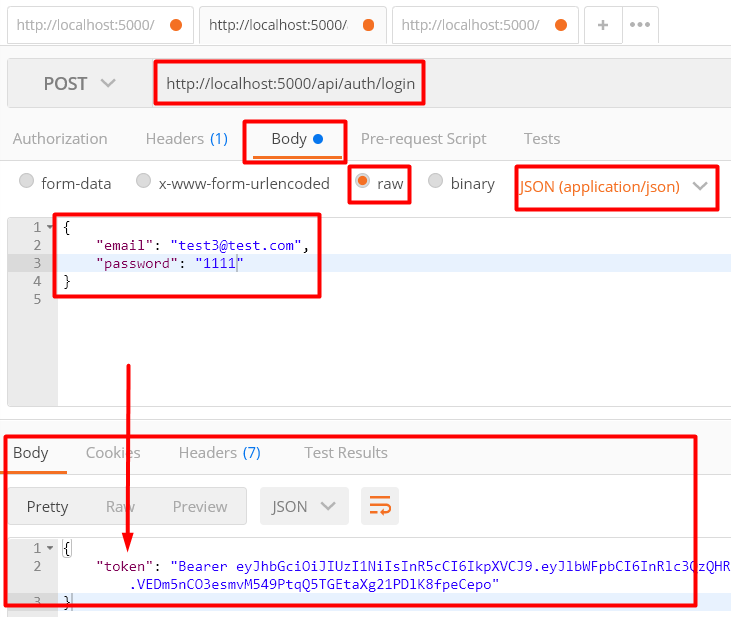
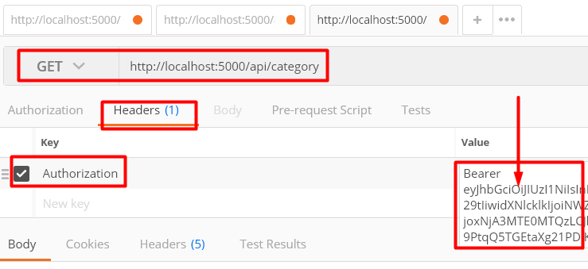
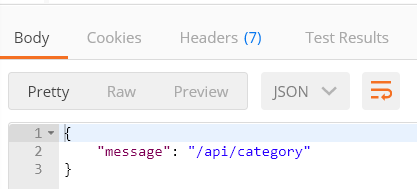

## 09. Защита роутов

В предыдущем уроке, мы написали логику, что после успешной авторизации, пользователь получает JWT-токен.  
Задача данного урока - предоставить доступ к роутам только тому пользователю, у которого есть JWT-токен, который во время запроса к роуту, будет передаваться в хедере. Для реализации данной задачи мы будем использовать библиотеку passport.js и её стратегию passport-jwt.  

Установка **passport.js** [http://www.passportjs.org/] и стратегии **passport-jwt** [http://www.passportjs.org/packages/passport-jwt/]:    
`npm i passport passport-jwt`

### 1. Подключение passport.js

*app.js*:
```js
// const express = require('express')
const passport = require('passport')
// ...

// const app = express()

app.use(passport.initialize())

// Подключаем файл в котором будет описана логика защиты роутов
// Конструкция "require('./middleware/passport')" вернет ф-цию, которую мы вызовем, передав в неё passport:
require('./middleware/passport')(passport)

// ...
```

### 2. Реализовываем функционал защиты роутов с помощью passport.js

Создаем файл *middleware\passport.js*:
```js
const JwtStrategy = require('passport-jwt').Strategy
const ExtractJwt = require('passport-jwt').ExtractJwt
const mongoose = require('mongoose')
const User = mongoose.model('users') // === const User = require('../models/user')
const keys = require('../config/keys')

var options = {}

// fromAuthHeaderAsBearerToken - данный метод извлекает токен из хедера
options.jwtFromRequest = ExtractJwt.fromAuthHeaderAsBearerToken()
options.secretOrKey = keys.jwt

// Данная ф-ция будет вызвана в файле app.js, в строке "require('./middleware/passport')(passport)"
module.exports = (passport) => {
	passport.use(
		new JwtStrategy(options, async (payload, done) => {
			try {
				/*
				Ищем запись пользователя, у которой поле id в БД совпадает со значением payload.userId
				payload.userId - получаем из токена, который был сгенерирован в файле controllers\auth.js:
					const token = jwt.sign(
						{
							email: candidate.email,
							userId: candidate._id
						}, 
						keys.jwt,
						{expiresIn: 60*60}
					)
				*/
				const user = await User.findById(payload.userId).select('email id')

				if (user) {
					// Если пользователь найден

					// Метод done - вызываем, чтобы вернуть полученный результат 
					// 1й параметр - ошибка, обрабатывать которую здесь не прийдется - поэтому null
					// 2й параметр - передаем данные, полученные из БД
					done(null, user)
				} else {
					done(null, false)
				}
			} catch {
				console.log(e)
			}
		})
	)
}
```

### 3. Защита роута '/api/category'

*routes\category.js*:
```js
// ...
const passport = require('passport')
// const router = express.Router()

router.get(
	'/', 
	passport.authenticate('jwt', {session: false}), // <---
	controller.getAll
)
```

При запросе на роут '/api/category' будем возвращать {message: '/api/category'}
*controllers\category.js*:
```js
module.exports.getAll = (req, res) => {
	res.json({message: 'category'})
}
```

### 4. Проверка роута '/api/category' в Postman

Отправляем get-запрос по адрессу http://localhost:5000/api/category и получаем ответ - *Unauthorized*. Так произошло потому, что passport посмотрел на запрос, который мы отправили и не нашел в нем токена, что значит, что мы не вошли в систему.    
Попробуем получить токен:    
   

Копируем данный токен и вставляем в хедер Authorization:    
   

Отправляем запрос и получаем правильный ответ:   

